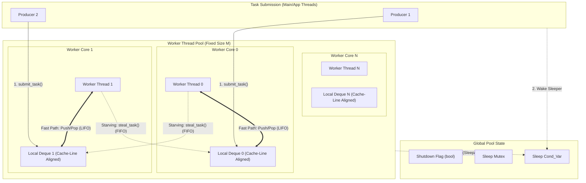
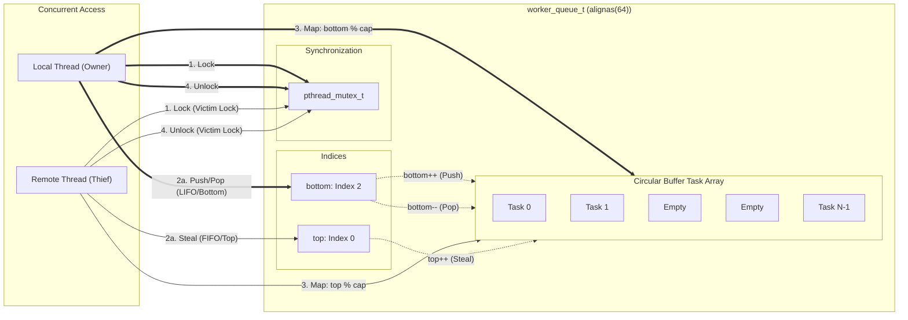

# Work-Stealing Task Scheduler in C

A high-performance, multithreaded task scheduler implementing a decentralized, work-stealing architecture in C using POSIX threads (`pthreads`).

# Architectural Overview

This scheduler moves beyond naive centralized thread pools, which suffer from severe lock contention on a single global queue at scale. Instead, it adopts a distributed "M:N" scheduling philosophy, mapping application tasks (N) onto fixed OS worker threads (M).

## Key Architectural Pillars

- **Distributed Deques**: Every worker thread owns a private Double-Ended Queue (Deque), completely isolating fast-path push/pop operations.

- **Work-Stealing**: When a worker's local deque is empty, it acts as a thief, randomly selecting peer queues to steal work from.

- **Hardware-Aware Data Design**: Cache-line alignment (`alignas(64)`) is used on per-thread data structures to physically prevent False Sharing, which would otherwise devastate performance via cache coherency traffic.

- **LIFO/FIFO Duality**:
  - **Owner (LIFO)**: Pushes and pops from the `bottom`. This stack-like behavior ensures superior Temporal Locality, keeping data hot in the physical core's L1 cache.

  - **Thief (FIFO)**: Steals older tasks from the `top`. This minimizes collision with the owner and often captures larger "parent" tasks, balancing load more effectively.

- **Graceful Shutdown & Backpressure**: Enforces global liveness invariants during shutdown (draining all peers before exiting) and utilizes randomized retries with `sched_yield`for producer backpressure.

## Architecture Diagrams

1. **Global Component Overview**
   This diagram shows the system flow from task submission by Producers to decentralized consumption and stealing by Workers.



<br><br> 2. **Deque Micro-Architecture & Concurrency Model**
This diagram details the interaction between the local Owner and a remote Thief on a single Bounded Circular Buffer Deque.



# Build and Test

## Prerequisites (basically none)

- A C compiler supporting `C11`.
- Linux/POSIX environment (`pthreads`).

## Compilation

Build the core library and the example program:

```c
// Basic build with optimizations
gcc -O2 -o pool main.c threadpool.c -lpthread

// Or separate compilation (cleaner)
gcc -O2 -c threadpool.h -o threadpool.o
gcc -O2 main.c threadpool.o -o pool -lpthread
```

## Verification & Stress Testing

We validate the scheduler invariants using a stress test with multiple producers.

```c
# Compile the stress test
gcc -O2 -o stress test.c threadpool.c -lpthread

# Run the stress test (400,000 tasks total)
./stress
```
